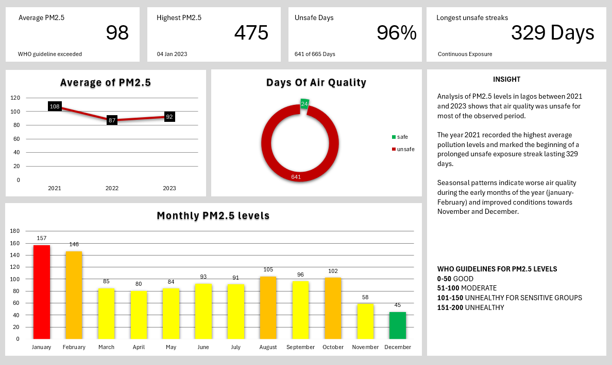

# Air-Quality-Index
# **Air Quality Index (PM2.5) Analysis — Lagos (2021–2023)**

## **1. Dataset Overview**

This project analyzes **PM2.5 air quality data in Lagos from 2021 to 2023** to assess pollution levels and potential public health risks.

* **Source:** OpenAfrica (via Kaggle)
* **Data Type:** Daily measurements
* **Metric:** PM2.5 concentration (µg/m³)

PM2.5 refers to fine particulate matter that can penetrate deep into the lungs and bloodstream, posing serious health risks.

---

## **2. Objective**

The goal of this project was to:

* Evaluate how often air quality exceeds safe exposure limits
* Identify seasonal pollution patterns
* Detect extreme pollution events
* Understand long-term exposure risks

---

## **3. Key Questions**

* How frequently does air pollution exceed safe levels?
* Are there seasonal patterns in PM2.5 levels?
* What are the highest recorded pollution levels?
* Is air pollution in Lagos occasional or persistent?

---

## **4. Tools & Methods**

**Tool Used:** Microsoft Excel

**Techniques Applied:**

* Data cleaning and validation
* Pivot Tables for aggregation
* Time-series analysis (daily → monthly trends)
* Lookup functions (INDEX + MATCH)
* Dashboard creation for visualization

Daily data was aggregated into monthly averages to reduce noise and highlight broader trends.

---

## **5. Dashboard Preview**

---

## **6. Key Insights**

* **Air quality is consistently unsafe:**
  Approximately **96% of days exceeded WHO recommended limits**, indicating widespread exposure risk.

* **Extreme pollution events occur:**
  The highest recorded PM2.5 level was **475 µg/m³ (January 4, 2023)**, far above safe thresholds.

* **Strong seasonal pattern identified:**
  Pollution levels peak during **January–February**, aligning with the Harmattan season.

* **Chronic exposure risk:**
  A **329-day continuous period of unsafe air quality** was observed, suggesting long-term health implications.

---

## **7. Real-World Implications**

This analysis shows that air pollution in Lagos is not occasional—it is **persistent and systemic**.

* Continuous exposure increases risk of:

  * Respiratory diseases
  * Cardiovascular conditions
  * Reduced lung function

* Data-driven insights can support:

  * Public health awareness
  * Environmental policy decisions
  * Urban planning strategies

---

## **8. Recommendations**

Based on the findings:

* Increase public awareness of PM2.5 health risks
* Implement seasonal interventions during Harmattan
* Introduce community health screenings
* Improve monitoring and regulation of pollution sources

---

## **9. Limitations**

* Possible outliers or measurement errors in the dataset
* Lack of supporting variables (e.g., weather, emissions sources)
* No external validation of extreme values

---

## **10. Conclusion**

This project demonstrates how data analysis can uncover critical insights from environmental data.

The findings indicate that air pollution in Lagos should be treated as a **continuous public health concern**, not just a seasonal issue.

---

## **11. About This Project**

This project is part of my transition into data analytics, where I am building skills in:

* Data analysis (Excel)
* Time-series analysis
* Data visualization
* Analytical thinking

I am particularly interested in applying data to **health and financial problem-solving**.

